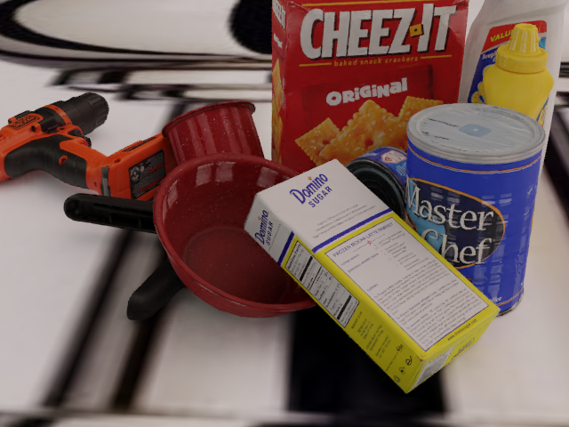
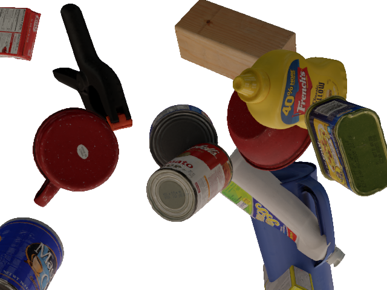
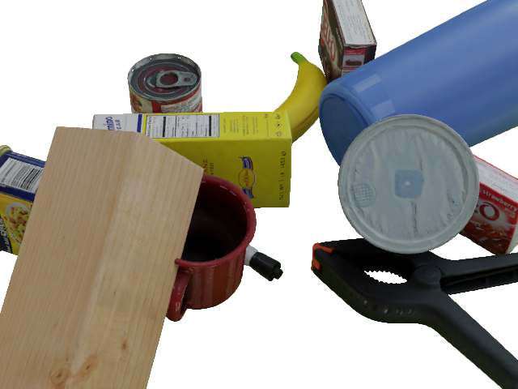

**BACHELOR THESIS 2021 at KIT and Bosch Tübingen**

This project is my bachelor thesis.

It uses the FFB6D network to estimate the poses of the YCB Video Dataset images.

My task was to find out how much synthetic data can easy the usage of real samples and what configurations make it most effective.

*Setup*
1. Clone this directory
2. Install the FFB6D according to the github page: https://github.com/ethnhe/FFB6D
3. Install the Amira Blender Rendering Framework and download the ycb video dataset according to the gibhub page: https://github.com/boschresearch/amira_blender_rendering
4. Replace the files of the 'Adapted_Files' directory 
5. Create the dataset using the directories 'Amira' and 'Convert_Amira_2_YCB'
6. Replace the 'data_syn' directory of the YCB video dataset (or rename it, i.e. 'data_syn_ori') with the own created dataset which have to be called 'data_syn' also
7. Edited the 'FFB6D/ffb6d/datasets/ycb/dataset_config/train_data_list.txt' file, i.e. use the 'Sim2Real/Used_Scripts/Create Train Test FFB6D File/create_train_test_FFB6D_file.py' file therefor
8. Start Training

Info: If you only want to create the synthetic images you don't need to fulfill step 3

*Usage*
1. Follow the instructions in the 'Amira' directory and run the shell script
2. Follow the instructions in the 'Convert_Amira_2_YCB' directory and run shell script

=======
My task is to find out how much synthetic data can simplify the usage of real samples and what configurations make it most effective.
>>>>>>> 449d0d71a775d6cc03c955b21efd7ae9389270a3
